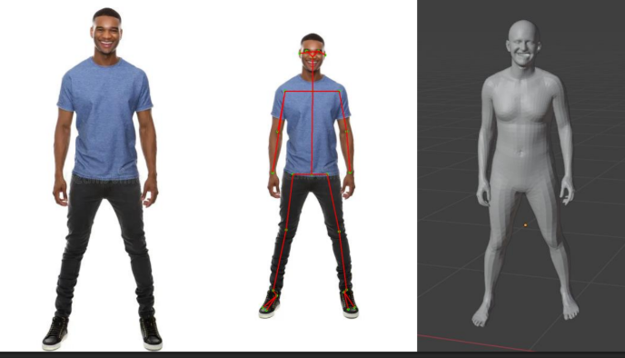

## RGB to 3D Reconstruction



This project transforms 2D RGB images or videos into 3D human body models using OpenPose for 2D keypoint extraction and SMPL-X for 3D mesh reconstruction. It provides a pipeline for visualizing realistic full-body pose and shape from monocular input.

### Features
* 2D keypoint detection using OpenPose
* 3D body, face, and hand mesh reconstruction using SMPL-X
* Input support for images and videos
* Visualization of 3D mesh in real-time or offline
* Easy-to-use UI interface

### Demo Command
 ```Shell
streamlit run demo.py
 ```


 ## Citation

```
@inproceedings{SMPL-X:2019,
  title = {Expressive Body Capture: 3D Hands, Face, and Body from a Single Image},
  author = {Pavlakos, Georgios and Choutas, Vasileios and Ghorbani, Nima and Bolkart, Timo and Osman, Ahmed A. A. and Tzionas, Dimitrios and Black, Michael J.},
  booktitle = {Proceedings IEEE Conf. on Computer Vision and Pattern Recognition (CVPR)},
  year = {2019}
}


@article{8765346,
    author = {Z. {Cao} and G. {Hidalgo Martinez} and T. {Simon} and S. {Wei} and Y. A. {Sheikh}},
    journal = {IEEE Transactions on Pattern Analysis and Machine Intelligence},
    title = {OpenPose: Realtime Multi-Person 2D Pose Estimation using Part Affinity Fields},
    year = {2019}
}

@inproceedings{simon2017hand,
    author = {Tomas Simon and Hanbyul Joo and Iain Matthews and Yaser Sheikh},
    booktitle = {CVPR},
    title = {Hand Keypoint Detection in Single Images using Multiview Bootstrapping},
    year = {2017}
}

@inproceedings{cao2017realtime,
    author = {Zhe Cao and Tomas Simon and Shih-En Wei and Yaser Sheikh},
    booktitle = {CVPR},
    title = {Realtime Multi-Person 2D Pose Estimation using Part Affinity Fields},
    year = {2017}
}

@inproceedings{wei2016cpm,
    author = {Shih-En Wei and Varun Ramakrishna and Takeo Kanade and Yaser Sheikh},
    booktitle = {CVPR},
    title = {Convolutional pose machines},
    year = {2016}
}

Paper links:
- OpenPose: Realtime Multi-Person 2D Pose Estimation using Part Affinity Fields:
    - [IEEE TPAMI](https://ieeexplore.ieee.org/document/8765346)
    - [ArXiv](https://arxiv.org/abs/1812.08008)
- [Hand Keypoint Detection in Single Images using Multiview Bootstrapping](https://arxiv.org/abs/1704.07809)
- [Realtime Multi-Person 2D Pose Estimation using Part Affinity Fields](https://arxiv.org/abs/1611.08050)
- [Convolutional Pose Machines](https://arxiv.org/abs/1602.00134)


```